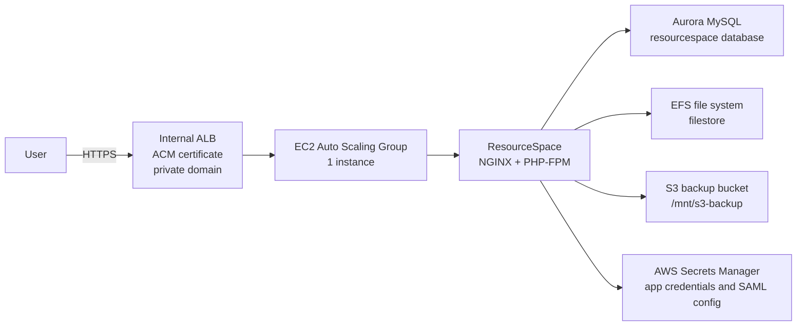
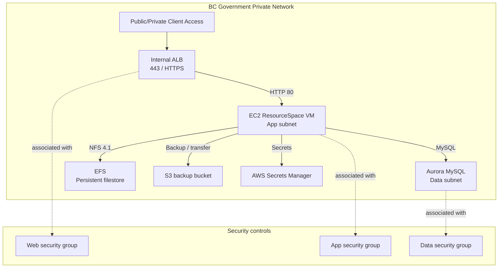

# BC Parks DAM Technical Architecture

## 1. Purpose and scope

The BC Parks Digital Asset Management (DAM) platform is a hosted ResourceSpace deployment for the BC Government environment. It is designed to provide a secure, private, single-tenant DAM environment for metadata-driven media management, document storage, and digital asset workflows.

The solution is implemented in AWS and is provisioned with Terraform and Terragrunt. The infrastructure supports separate dev, test, and prod environments and is intentionally aligned to the government’s internal network model and security controls.

---

## 2. High-level architecture

The application runs in a private AWS VPC behind an internal Application Load Balancer (ALB). The ALB distributes traffic to a single EC2 instance in an Auto Scaling Group. ResourceSpace itself runs on Debian-based Linux with NGINX and PHP-FPM. The app stores structured data in Aurora MySQL and file content in EFS, with an S3 bucket used for backup and transfer workflows.

### Network topology view

This view emphasizes the private-only placement pattern: users reach the app through the internal ALB, while the database and filesystem remain inside the protected data-plane network segments.

---

## 3. Platform components

### 3.1 Compute layer

- EC2 instances are launched from a Debian 13 AMI defined in `src/terraform/variables.tf`.
- The instance type is environment-specific:
  - dev: `t3a.small`
  - test: `t3a.small`
  - prod: `t3a.large`
- An Auto Scaling Group is created with `min_size = 1`, `max_size = 1`, and `desired_capacity = 1`.
- The ASG uses an EC2 launch template and attaches the target group used by the ALB.
- Health checks are performed through the ALB target group, using `/bcgovhealthcheck`.

This indicates the current pattern is intentionally a single-node deployment, with operational resilience coming from instance replacement rather than horizontal scale-out.

### 3.2 Application layer

ResourceSpace is deployed from a checked-out Git repository and a release directory such as `11.0-r29509`, then copied into `/var/www/resourcespace` during instance bootstrap.

The runtime stack includes:

- NGINX as the web server
- PHP-FPM for PHP execution
- ResourceSpace application files and templates
- SimpleSAMLphp for identity-provider integration
- APCu, ImageMagick, ffmpeg, Ghostscript, ExifTool, and ClamAV for media processing and scanning
- Cron jobs for offline jobs, staticsync, and cleanup

The app bootstrap process is defined in `src/terraform/userdata.tpl` and performs the installation, package setup, resource-space configuration, filesystem mounting, and service restarts.

### 3.3 Data layer

#### Aurora MySQL

- RDS Aurora MySQL cluster is created with `aurora-mysql` engine version `8.0.mysql_aurora.3.10.3`.
- Database name: `resourcespace`
- Cluster runs in private data subnets.
- Storage is encrypted at rest.
- Backup retention is set to 5 days and a preferred backup window is configured.
- The cluster is accessible only from the application VPC and private security groups; it is not publicly exposed.

#### EFS

- An Amazon EFS volume is mounted at `/var/www/resourcespace/filestore`.
- This is the persistent content repository for ResourceSpace and holds uploaded files, media, and application state that should survive EC2 replacement.
- It is mounted over NFS v4.1, which makes it suitable for shared and persistent asset storage.

#### S3 backup bucket

- An S3 bucket named `bcparks-dam-backup-${target_env}` is provisioned.
- It is mounted at `/mnt/s3-backup` via `s3fs`.
- The bucket is used for:
  - database backup export/import workflows
  - file transfer operations
  - operational export jobs

---

## 4. Network and security architecture

### 4.1 VPC and subnet layout

The environment uses pre-provisioned AWS networking resources rather than creating a full network from scratch. Terraform reads the VPC and security groups by tag and name filters:

- Web security group
- App security group
- Data security group
- Public subnets for ALB placement
- App subnets for application servers
- Data subnets for RDS and data services

This model assumes the hosting foundation is provisioned by the government platform team and the app stack attaches to those shared network resources.

### 4.2 Load balancing

The ALB is created as an internal load balancer:

- `internal = true`
- `load_balancer_type = "application"`
- listener on port 443 with HTTPS and a valid ACM certificate
- target group forwards to port 80 on the EC2 instance

A host-based routing rule forwards all matching hostnames to the app target group.

### 4.3 Security posture

Security controls in this implementation include:

- Private-only ALB and database
- Security groups scoped to the app-network model
- EC2 access via AWS Systems Manager Session Manager after the SSM agent is installed
- Secrets injected into the instance bootstrap process from AWS Secrets Manager values
- TLS termination at the ALB using an internal certificate
- Strict file permissions for the ResourceSpace web root and data directories
- Encrypt-at-rest for Aurora storage

Representative sensitive configuration includes:

- MySQL credentials
- SAML metadata and certificate values
- ResourceSpace secret salts and spider configuration
- email and auth settings

---

## 5. Deployment architecture

### 5.1 Infrastructure as code

The repo uses Terraform and Terragrunt to manage infrastructure:

- `src/terraform/` contains infrastructure resources and variable definitions
- `src/terraform/terragrunt/dev`, `test`, and `prod` contain environment-specific Terragrunt config

Terragrunt generates environment-specific tfvars files and toggles the target environment and branch name. The templates create a consistent deployment pattern across the lifecycle environments.

### 5.2 Bootstrap flow

On first boot, the EC2 instance executes a user-data script that performs these operations:

1. Installs SSM agent, NGINX, PHP, and required PHP extensions.
2. Clones the DAM repo and restricts the checkout to the desired ResourceSpace release and supporting files.
3. Copies the app into `/var/www/resourcespace`.
4. Mounts the EFS filestore.
5. Mounts the S3 backup bucket at `/mnt/s3-backup`.
6. Appends runtime configuration to `include/config.php` using secrets and environment variables.
7. Installs ImageMagick, ffmpeg, ClamAV, and other media-processing dependencies.
8. Configures cron entries for asynchronous jobs.
9. Restarts PHP-FPM and NGINX.

This script is central to the platform. It turns a generic Debian AMI into a fully configured ResourceSpace node.

### 5.3 Release strategy

The app uses a Git-based deployment model in which the instance checks out a desired branch and a selected ResourceSpace release directory. The `resourcespace_release_version` is configurable via Terraform variable and defaults to `11.0-r29509`.

As a result, the app is effectively pinned to a stable release while still allowing the repo branch to be updated for environment-specific changes.

---

## 6. Runtime data flow

1. A user or system accesses the application through the internal ALB.
2. The ALB forwards traffic to the EC2 instance.
3. NGINX passes the request to PHP-FPM.
4. ResourceSpace reads and writes:
   - Aurora MySQL for application metadata and configuration data
   - EFS for uploaded asset files and application filestore content
5. Scheduled jobs process offline tasks, sync static content, and clean temporary files.
6. Backup or migration workflows read and write to the mounted S3 bucket.

This combination gives the application an operational split between transactional data (RDS) and file-centric storage (EFS/S3).

---

## 7. Identity and authentication

The deployment includes a SimpleSAMLphp integration layer configured through generated config fragments. The bootstrap script injects:

- SAML entity IDs
- IdP details
- metadata URLs
- certificate values
- contact configuration
- secret salt values

This allows the application to integrate with an external identity provider while keeping SAML-specific secrets outside the codebase and in managed secret storage.

---

## 8. Operational considerations

### 8.1 Logging and diagnostics

The deployment includes several operational references:

- `/var/log/userdata.log` for bootstrap logging
- `/opt/bitnami/apache2/logs/error_log` from the original Bitnami-based guidance
- AWS Auto Scaling Group activity logs for EC2 startup failures
- ResourceSpace installation checks under the application UI

### 8.2 Automation and maintenance

The app includes scheduled cron operations:

- offline jobs queue processing
- staticsync execution
- temporary file cleanup

This keeps the platform functional for background media-processing tasks without requiring a manual intervention loop.

### 8.3 Recovery and migration

The repository documentation calls out a manual recover/migration flow that includes:

- retrieving instance credentials from `bitnami_credentials`
- pulling sensitive settings from the default Bitnami config
- backing up the local MySQL database
- restoring the database onto Aurora RDS
- copying file store data from the local filestore to the EFS-backed filestore

This is a useful operational pattern when onboarding or recovering from a database or package migration.

---

## 9. Key design constraints and trade-offs

### Single-instance design

The current ASG configuration intentionally keeps the environment at one active EC2 instance. This reduces complexity for government-hosted workloads and keeps management simpler, but it also means the service is not horizontally scaled by default.

### Internal-only access

The ALB is internal and not public-facing. This aligns with the BCGov private network pattern but requires the application to be reached through internal routing or approved network paths.

### Stateful runtime storage

The platform relies on EFS and Aurora for persistence. This is a strong architecture choice for stateful app workloads, but it requires operational discipline around backup, restore, and migration steps.

### Bootstrap dependency on generated secrets

Because the user-data bootstrap script injects secrets into `config.php`, the platform is highly dependent on the secrets being present and correctly mapped before the instance is launched.

---

## 10. Summary

The BC Parks DAM platform is a private AWS-hosted ResourceSpace environment built around a standard Linux + NGINX + PHP-FPM stack, backed by Aurora MySQL and EFS. Terraform and Terragrunt define the infrastructure, and user-data automation converts a generic base image into a production-ready DAM node with media processing, SAML, file storage, and backup integration.

The architecture is intentionally conservative and operations-friendly: private networking, managed database services, persistent shared storage, and scripted bootstrap logic all support a secure and maintainable deployment model for BC Parks.

## Related documents

- [technical-architecture-summary.md](technical-architecture-summary.md): executive summary for leadership and stakeholder review
